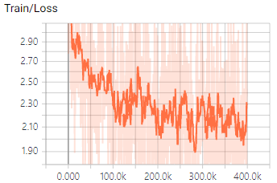
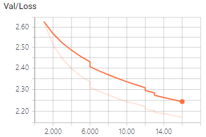

# KoGPT2-LegalLM

### 모델

한국어 GPT-2 from [SKT-AI](https://github.com/SKT-AI/KoGPT2)

Pre-train 된 GPT-2를 법률 데이터에 대해 2차 pre-train

```
embedding size: 768
hidden size: 768
max input length: 1024
vocab size: 50000
number of layers: 12
number of attention heads: 12
```

### 학습 데이터

* AI hub
  * 법률 판례 데이터
* 법률 상담 데이터
* 총 **125M sub words**
  * Sentencepiece 사용

### 학습

Nvidia 2080ti 8장으로 학습



